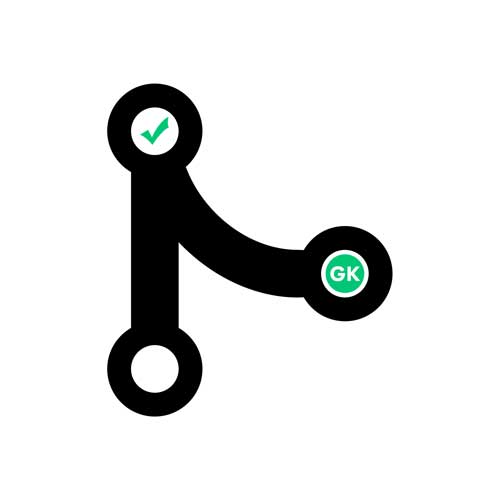

# greenkeeper-keeper

`greenkeeper-keeper` is a service to automatically merge passing [greenkeeper](https://greenkeeper.io) PRs

## Motivation

[Greenkeeper](https://greenkeeper.io) is a fantastic service that makes it easy for me to keep dependencies up to date. However, it can get a bit noisy and create quite a few PRs. Hence, [the birth of greenkeeper-keeper](https://medium.com/@kurtiskemple/keeping-up-with-greenkeeper-io-a8d6c1703e4a).

To help you keep up with all of that activity, `greenkeeper-keeper` can automatically accept PRs from [greenkeeper](https://github.com/integration/greenkeeper) as long as all of your commit status checks pass.

## Designed to help, not take over

`greenkeeper-keeper` is limited to handling only PRs from greenkeeper. It will not attempt to accept PRs from other sources.

It will only accept PRs that have passing [commit status checks](https://help.github.com/articles/about-required-status-checks/). If any checks fail, `greenkeeper-keeper` will comment on the PR to inform you that it could not accept the PR and will let you take care of resolving the problem.

## Setting up your own instance

### Things you will need

* A GitHub account with access to the repositories for which you want greenkeeper PRs automatically accepted. A "bot" account is recommended.
* A personal access token for the account above with the `repo` and `repo:read_hooks` scopes. This token should be separate from any other tasks that the bot account is used for so that it is dedicated only to the `greenkeeper-keeper` service.
* A `greenkeeper-keeper` [server instance](#instance-deployment-options) (Be sure to proved the required configuration in the format for the option that you choose)
* Webhooks need to be [configured](#setting-up-webhooks) for each repository for which you want `greenkeeper-keeper` to handle greenkeeper PRs.

### Instance deployment options

* Include [the hapi-plugin](https://github.com/greenkeeper-keeper/hapi-greenkeeper-keeper) in your own [hapi](https://hapijs.com) server. This is the recommended option because it is the simplest way for you to configure your instance to keep itself up to date.
* Deploy the [reference instance](https://github.com/greenkeeper-keeper/reference-instance) directly to your chosen host, like [Heroku](https://heroku.com/deploy).
* A prebuilt [Docker](https://www.docker.com/) image is available on [Docker Hub](https://hub.docker.com/) under [`greenkeeperkeeper/reference-instance`](https://hub.docker.com/r/greenkeeperkeeper/reference-instance/)

### Setting up webhooks

Once your service is up and running, you will want to set up [webhooks](https://developer.github.com/webhooks) for the repositories you want `greenkeeper-keeper` to manage.

* Select _only_ the `pull_request` event when enabling the webhook
* Set the url to `<url for your deployed greenkeeper-keeper instance>/payload` (don't forget the `/payload`)
